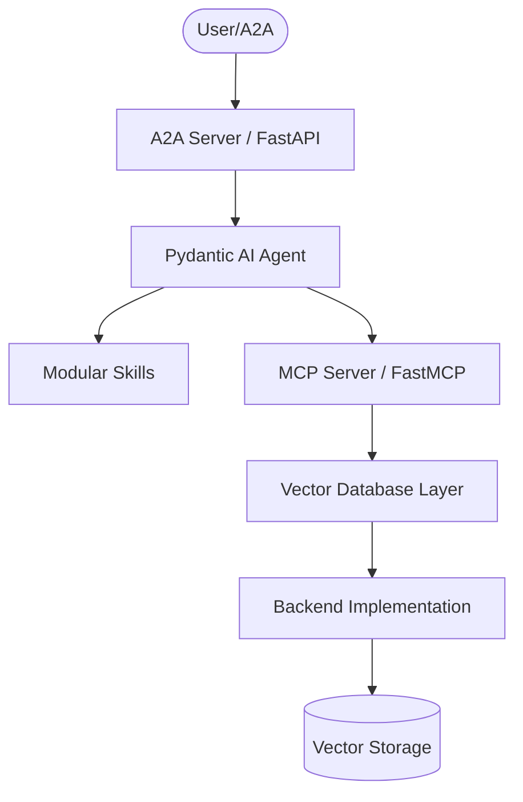
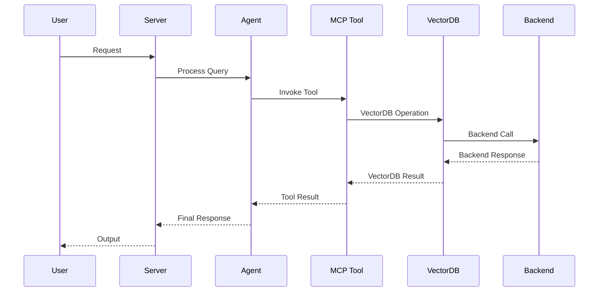

# AGENTS.md

> Claude Code loads this file via `CLAUDE.md` (`@AGENTS.md` import) — the two stay
> in sync. Edit **this** file, not `CLAUDE.md`.

## Tech Stack & Architecture
- Language/Version: Python 3.10+
- Core Libraries: `agent-utilities`, `fastmcp`, `pydantic-ai`
- Key principles: Functional patterns, Pydantic for data validation, asynchronous tool execution.
- Architecture:
    - `mcp_server.py`: Main MCP server entry point and tool registration.
    - `agent.py`: Pydantic AI agent definition and logic.
    - `skills/`: Directory containing modular agent skills (if applicable).
    - `vectordb/`: Vector database implementations for multiple backends.
    - `retriever/`: Retriever implementations for each backend.

### Architecture Diagram


### Workflow Diagram


## Commands (run these exactly)
# Installation
pip install .[all]

# Quality & Linting (run from project root)
pre-commit run --all-files

# Execution Commands
# vector-mcp\nvector_mcp.mcp:mcp_server\n# vector-agent\nvector_mcp.agent:agent_server

# Testing
# Start test databases
podman-compose -f docker-compose.test.yml up -d

# Run all tests
python -m pytest tests/test_all_backends.py -v

# Run specific backend tests
python -m pytest tests/test_all_backends.py -k chromadb -v
python -m pytest tests/test_all_backends.py -k postgres -v
python -m pytest tests/test_all_backends.py -k mongodb -v
python -m pytest tests/test_all_backends.py -k qdrant -v
python -m pytest tests/test_all_backends.py -k couchbase -v

# Stop test databases
podman-compose -f docker-compose.test.yml down

## Project Structure Quick Reference
- MCP Entry Point → `mcp_server.py`
- Agent Entry Point → `agent.py`
- Source Code → `vector_mcp/`
- Skills → `skills/` (if exists)
- VectorDB Implementations → `vector_mcp/vectordb/`
- Retriever Implementations → `vector_mcp/retriever/`
- Tests → `tests/`

### File Tree
```text
├── .bumpversion.cfg
├── .dockerignore
├── .env
├── .gitattributes
├── .github
│   └── workflows
│       └── pipeline.yml
├── .gitignore
├── .pre-commit-config.yaml
├── AGENTS.md
├── Dockerfile
├── LICENSE
├── MANIFEST.in
├── README.md
├── compose.yml
├── debug.Dockerfile
├── docker-compose.test.yml
├── mcp
│   ├── documents
│   └── pgdata
├── mcp.compose.yml
├── pyproject.toml
├── pytest.ini
├── requirements.txt
├── scripts
│   ├── debug_embedding.py
│   ├── debug_full.py
│   ├── debug_pg.py
│   ├── investigate_timeout.py
│   ├── test_embedding.py
│   ├── validate_a2a_agent.py
│   ├── validate_agents.py
│   ├── validate_all_dbs.py
│   └── verify_deps.py
├── tests
│   ├── README.md
│   ├── TEST_RESULTS.md
│   ├── reproduce_chunking.py
│   ├── test_all_backends.py
│   ├── test_databases.py
│   ├── test_optional_dependencies.py
│   ├── test_protocol_compliance.py
│   ├── test_pruning.py
│   └── test_vector_mcp_server.py
└── vector_mcp
    ├── __init__.py
    ├── __main__.py
    ├── agent.py
    ├── mcp_server.py
    ├── retriever
    │   ├── __init__.py
    │   ├── chromadb_retriever.py
    │   ├── couchbase_retriever.py
    │   ├── llamaindex_retriever.py
    │   ├── mongodb_retriever.py
    │   ├── postgres_retriever.py
    │   ├── qdrant_retriever.py
    │   └── retriever.py
    └── vectordb
        ├── __init__.py
        ├── base.py
        ├── chromadb.py
        ├── couchbase.py
        ├── db_utils.py
        ├── mongodb.py
        ├── postgres.py
        └── qdrant.py
```

## Code Style & Conventions
**Always:**
- Use `agent-utilities` for common patterns (e.g., `create_mcp_server`, `create_agent`).
- Define input/output models using Pydantic.
- Include descriptive docstrings for all tools (they are used as tool descriptions for LLMs).
- Check for optional dependencies using `try/except ImportError`.
- Use manual vector operations when SDK authentication issues arise (see MongoDB/Couchbase implementations).

**Good example:**
```python
from agent_utilities import create_mcp_server
from mcp.server.fastmcp import FastMCP

mcp = create_mcp_server("my-agent")

@mcp.tool()
async def my_tool(param: str) -> str:
    """Description for LLM."""
    return f"Result: {param}"
```

## Vector Database Backends

### Supported Backends
- **ChromaDB**: Local filesystem-based vector database (no container required)
- **PostgreSQL/PGVector**: PostgreSQL with pgvector extension (container required)
- **MongoDB**: MongoDB with manual cosine similarity calculation (container required)
- **Qdrant**: Qdrant vector database (container required)
- **Couchbase**: Couchbase with REST API fallback and manual cosine similarity (container required, partially functional)

### Implementation Notes
- **MongoDB**: Uses raw MongoClient instead of MongoDBAtlasVectorSearch to avoid authentication issues with local test containers. Implements manual cosine similarity calculation for semantic search.
- **Couchbase**: Uses simple client approach with REST API fallback to bypass SDK authentication issues. Implements manual cosine similarity calculation for semantic search. Core search functionality working (10/14 tests passing), CRUD operations limited by N1QL service configuration.
- **PostgreSQL**: Uses native PGVector with proper JSONB querying for get_documents_by_ids.
- **Qdrant**: Uses Qdrant client with proper payload handling.
- **ChromaDB**: Uses ChromaDB client with metadata-based ID resolution.

### Test Coverage
- **ChromaDB**: 14/14 tests passing (100%)
- **PostgreSQL**: 14/14 tests passing (100%)
- **MongoDB**: 14/14 tests passing (100%)
- **Qdrant**: 14/14 tests passing (100%)
- **Couchbase**: 10/14 tests passing (71% - search operations working)
- **Overall**: 66/70 tests passing (94.3%)

See `tests/TEST_RESULTS.md` for detailed test results and known issues.

## Dos and Don'ts
**Do:**
- Run `pre-commit` before pushing changes.
- Use existing patterns from `agent-utilities`.
- Keep tools focused and idempotent where possible.
- Check for optional dependencies before importing backend-specific libraries.
- Use manual vector operations when SDK authentication issues arise.
- Run tests after making changes to vector database implementations.

**Don't:**
- Use `cd` commands in scripts; use absolute paths or relative to project root.
- Add new dependencies to `dependencies` in `pyproject.toml` without checking `optional-dependencies` first.
- Hardcode secrets; use environment variables or `.env` files.
- Assume all backends are available; check for optional dependencies.
- Modify vector database implementations without running the corresponding tests.

## Safety & Boundaries
**Always do:**
- Run lint/test via `pre-commit`.
- Use `agent-utilities` base classes.
- Test vector database implementations with the comprehensive test suite.
- Check for optional dependencies before using backend-specific features.

**Ask first:**
- Major refactors of `mcp_server.py` or `agent.py`.
- Deleting or renaming public tool functions.
- Changing the VectorDB base class interface.
- Adding new vector database backends.

**Never do:**
- Commit `.env` files or secrets.
- Modify `agent-utilities` or `universal-skills` files from within this package.
- Skip tests after modifying vector database implementations.
- Hardcode database credentials; use environment variables.

## When Stuck
- Propose a plan first before making large changes.
- Check `agent-utilities` documentation for existing helpers.
- Review `tests/TEST_RESULTS.md` for known issues and solutions.
- Check the implementation of working backends for patterns to follow.
- Run the comprehensive test suite to validate changes.


## Testing with Timeout

To run tests with a timeout to prevent hanging, use the `pytest-timeout` plugin. You can combine it with the `-k` flag to run specific tests:

```bash
uv run pytest --timeout=60 -k "test_name_pattern"
```

## ⛔ No Scratch or Temporary Files in Repository

**NEVER write any of the following to this repository:**
- Temporary test scripts (`test_*.py`, `debug_*.py` outside of `tests/`)
- Scratch scripts or experimental one-off files
- Log files (`.log`, `.txt` command output)
- Random text files with command output or debug dumps
- Any file that is NOT production source code, tests in `tests/`, or documentation

**Why:** These files expose private filesystem paths, credentials, and internal infrastructure details when pushed to GitHub publicly.

**Where to put scratch work instead:**
- Use `~/workspace/scratch/` for temporary scripts and experiments
- Use `~/workspace/reports/` for command output and reports
- Keep test scripts in the `tests/` directory following proper pytest conventions

## ⛔ Keep the Repository Root Pristine — No Scratch / Temp / Debug Files

**The repository ROOT must contain only canonical project files** (packaging,
config, docs, lockfiles). The only hidden directories allowed at root are
`.git/`, `.github/`, and `.specify/` (plus a local, git-ignored `.venv/`).

**NEVER write any of the following — anywhere in the repo, and ESPECIALLY at the root:**
- One-off / debug / migration scripts: `fix_*.py`, `migrate_*.py`, `refactor_*.py`,
  `replace_*.py`, `update_*.py`, `debug_*.py`, or `test_*.py` **at the root**
  (real tests live in `tests/` only).
- Databases / data dumps: `*.db`, `*.db-wal`, `*.sqlite*`, `*.corrupted`.
- Logs / command output: `*.log`, scratch `*.txt`, `*.orig`, `*.rej`, `*.bak`.
- Build artifacts: `*.tsbuildinfo`, compiled binaries, coverage files.
- AI agent scratch directories: `.agent/`, `.agents/`, `.agent_data/`, `.tmp/`,
  `.hypothesis/`, or any per-tool cache committed to git.
- Any file that is NOT production source, a test in `tests/`, documentation, or
  a recognized config/lockfile.

**Why:** scratch at the root leaks private paths/credentials, bloats the tree,
and erodes a pristine codebase.

**Where scratch goes instead:** `~/workspace/scratch/` (experiments),
`~/workspace/reports/` (command output); tests go in `tests/` (pytest).
Before finishing a task, run `git status` and confirm no stray root files were added.

<!-- BEGIN concept-coordination (generated) -->
## Concept-ID Coordination (multi-session)

Working in parallel with other sessions/worktrees? **Reserve a concept id before you write its `CONCEPT:` marker** so two sessions never collide:

```bash
agent-utilities --json concept reserve --ns KG-2   # or a package prefix, e.g. KEY
```

Full protocol (ledger, merge=union, reconcile, MCP/REST): <https://knuckles-team.github.io/agent-utilities/concept_coordination/>
<!-- END concept-coordination (generated) -->
