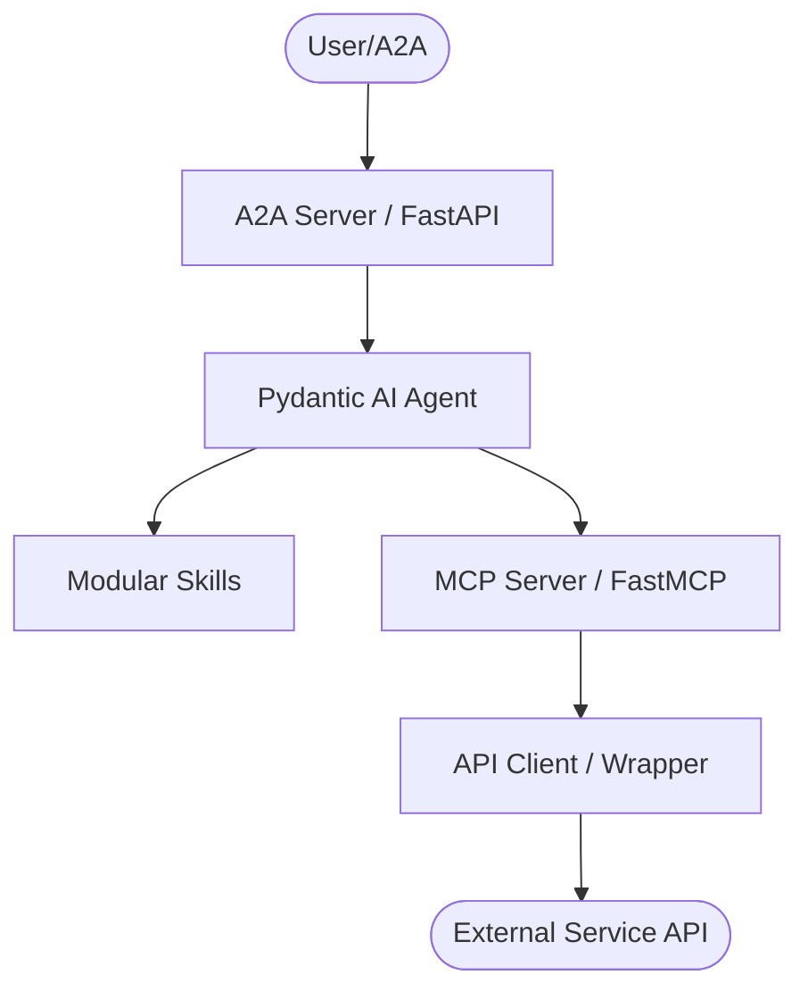
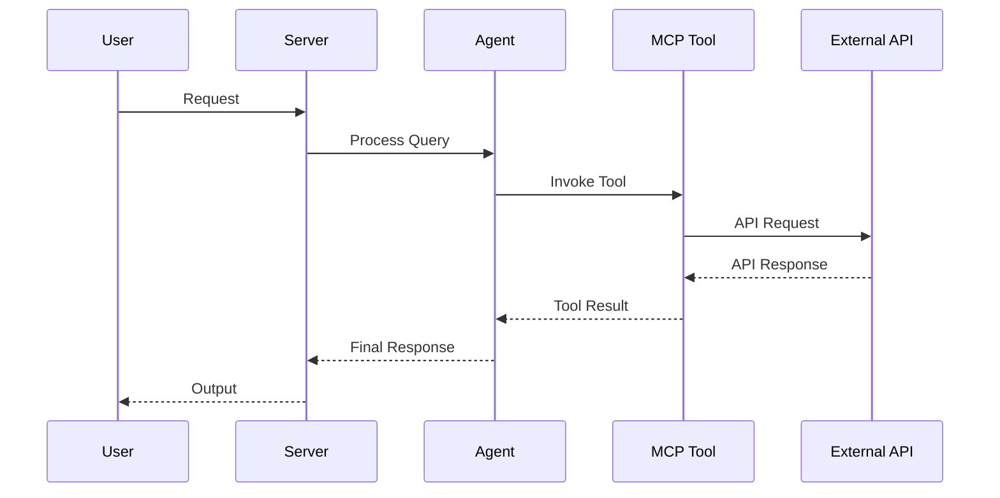

# AGENTS.md

## Tech Stack & Architecture
- Language/Version: Python 3.10+
- Core Libraries: `agent-utilities`, `fastmcp`, `pydantic-ai`
- Key principles: Functional patterns, Pydantic for data validation, asynchronous tool execution.
- Architecture:
    - `mcp.py`: Main MCP server entry point and tool registration.
    - `agent.py`: Pydantic AI agent definition and logic.
    - `skills/`: Directory containing modular agent skills (if applicable).
    - `agent/`: Internal agent logic and prompt templates.

### Architecture Diagram


### Workflow Diagram


## Commands (run these exactly)
# Installation
pip install .[all]

# Quality & Linting (run from project root)
pre-commit run --all-files

# Execution Commands
# vector-mcp\nvector_mcp.mcp:mcp_server\n# vector-agent\nvector_mcp.agent:agent_server

## Project Structure Quick Reference
- MCP Entry Point → `mcp.py`
- Agent Entry Point → `agent.py`
- Source Code → `vector_mcp/`
- Skills → `skills/` (if exists)

### File Tree
```text
├── .bumpversion.cfg\n├── .dockerignore\n├── .env\n├── .gitattributes\n├── .github\n│   └── workflows\n│       └── pipeline.yml\n├── .gitignore\n├── .pre-commit-config.yaml\n├── .pytest_cache\n│   ├── .gitignore\n│   ├── CACHEDIR.TAG\n│   ├── README.md\n│   └── v\n│       └── cache\n├── AGENTS.md\n├── Dockerfile\n├── LICENSE\n├── MANIFEST.in\n├── README.md\n├── compose.yml\n├── debug.Dockerfile\n├── mcp\n│   ├── documents\n│   └── pgdata\n├── mcp.compose.yml\n├── pyproject.toml\n├── pytest.ini\n├── requirements.txt\n├── scripts\n│   ├── debug_embedding.py\n│   ├── debug_full.py\n│   ├── debug_pg.py\n│   ├── investigate_timeout.py\n│   ├── test_embedding.py\n│   ├── validate_a2a_agent.py\n│   ├── validate_agents.py\n│   ├── validate_all_dbs.py\n│   └── verify_deps.py\n├── tests\n│   ├── reproduce_chunking.py\n│   ├── test_databases.py\n│   ├── test_optional_dependencies.py\n│   ├── test_protocol_compliance.py\n│   ├── test_pruning.py\n│   └── test_vector_mcp.py\n└── vector_mcp\n    ├── __init__.py\n    ├── __main__.py\n    ├── agent\n    │   ├── AGENTS.md\n    │   ├── CRON.md\n    │   ├── CRON_LOG.md\n    │   ├── HEARTBEAT.md\n    │   ├── IDENTITY.md\n    │   ├── MEMORY.md\n    │   ├── USER.md\n    │   ├── mcp_config.json\n    │   └── templates.py\n    ├── agent.py\n    ├── mcp.py\n    ├── retriever\n    │   ├── __init__.py\n    │   ├── chromadb_retriever.py\n    │   ├── couchbase_retriever.py\n    │   ├── llamaindex_retriever.py\n    │   ├── mongodb_retriever.py\n    │   ├── postgres_retriever.py\n    │   ├── qdrant_retriever.py\n    │   └── retriever.py\n    └── vectordb\n        ├── __init__.py\n        ├── base.py\n        ├── chromadb.py\n        ├── couchbase.py\n        ├── db_utils.py\n        ├── mongodb.py\n        ├── postgres.py\n        └── qdrant.py
```

## Code Style & Conventions
**Always:**
- Use `agent-utilities` for common patterns (e.g., `create_mcp_server`, `create_agent`).
- Define input/output models using Pydantic.
- Include descriptive docstrings for all tools (they are used as tool descriptions for LLMs).
- Check for optional dependencies using `try/except ImportError`.

**Good example:**
```python
from agent_utilities import create_mcp_server
from mcp.server.fastmcp import FastMCP

mcp = create_mcp_server("my-agent")

@mcp.tool()
async def my_tool(param: str) -> str:
    """Description for LLM."""
    return f"Result: {param}"
```

## Dos and Don'ts
**Do:**
- Run `pre-commit` before pushing changes.
- Use existing patterns from `agent-utilities`.
- Keep tools focused and idempotent where possible.

**Don't:**
- Use `cd` commands in scripts; use absolute paths or relative to project root.
- Add new dependencies to `dependencies` in `pyproject.toml` without checking `optional-dependencies` first.
- Hardcode secrets; use environment variables or `.env` files.

## Safety & Boundaries
**Always do:**
- Run lint/test via `pre-commit`.
- Use `agent-utilities` base classes.

**Ask first:**
- Major refactors of `mcp.py` or `agent.py`.
- Deleting or renaming public tool functions.

**Never do:**
- Commit `.env` files or secrets.
- Modify `agent-utilities` or `universal-skills` files from within this package.

## When Stuck
- Propose a plan first before making large changes.
- Check `agent-utilities` documentation for existing helpers.
